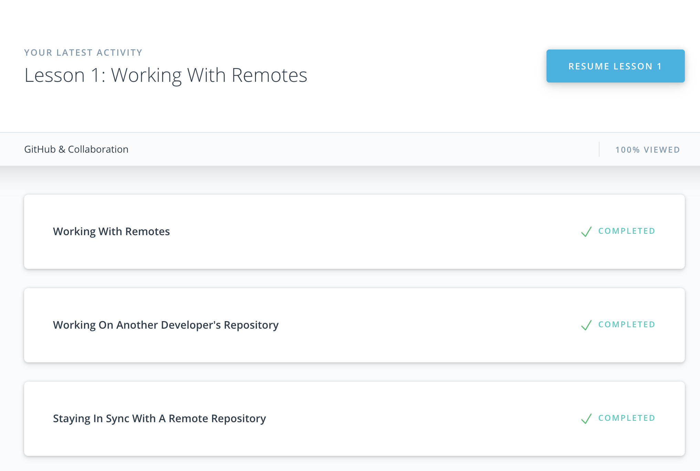

# Kottans Backend Course Progress

---
## Git and GitHub
 
 1. Udacity course gave a great overview about what is git and its main features.
    
 
 2. try.github.io tasks provided more complex and challenging git tasks.
    
    
    
 
### New things and things to remember:  
  `git diff` - show diff  
  `git add .` - add all changed tracked files to staging  
  `git checkout -b <branch name>` - create branch and checkout  
  `git commit -m <commit message>` - create commit with commit message  
  `git log --oneline --graph --all --decorated` - show all commits in branch tree  
  `git show <commit sha>` - commit info  
  `git diff --name-only --cached` - show staged filenames only  
  `git reset` - unstage all the staged files  
  `git rebase -i <base>` - interactive rebase of commit to new base  
 
--- 
## Unix Shell
 
 1. Linux Survival
 
    Basically all summary for this lesson can be viewed on the screenshots
    
    
    
    
    
 2. Learning the Shell section on linuxcommand.org
 
### New things and things to remember:  
    
  for chmod (`chmod 600 some_file`):
        
      rwx = 111 in binary = 7  
      rw- = 110 in binary = 6  
      r-x = 101 in binary = 5  
      r-- = 100 in binary = 4  
  `kill -l` gives a list of the signals kill supports
  `jobs` - an alternate way of listing your own processes
  `bg` - put a process in the background
  `fg` - put a process in the forground
  `man <command>` - manual for command

---    
## Git Collaboration 

  1. Udacity course progress:
   

### New things and things to remember:  
   `git remote add <shortname> <remote_repo_url>` - add remote  
   `git remote -v` - show all remotes  
   `git push <remote_shortname> <branch_name>` - push changes to remote  
   `git pull <remote_shortname> <branch_name>` - pull changes from remote  
   `git fetch <remote_shortname> <branch_name>` - fetch from remote  
   `git merge origin/master` - merge branch (make git checkout first)  
   `git shortlog` - displays an alphabetical list of names and the commit messages that go along with them. If we just want to see just the number of commits that each developer has made, we can add a couple of flags: -s to show just the number of commits (rather than each commit's message) and -n to sort them numerically (rather than alphabetically by author name).  
   `git log --author=<Author>` - display all commits by Author  
   `git log --grep=<aprt of commit message>` - display commit by message  
   `git remote rename <old_name> <new_name>` - rename remote  
    
   CONTRIBUTING.md file usually lists out the information you should follow to contribute to the project.
    
   To create a pull request, a couple of things need to happen:  
    - you must fork the source repository  
    - clone your fork down to your machine  
    - make some commits (ideally on a topic branch!)  
    - push the commits back to your fork  
    - create a new pull request and choose the branch that has your new commits  
    
   To remove files/folders on remote but keep in local working directory:  
   `git rm -r --cached File-or-FolderName`  
   `git commit -m "Removed folder from repository"`  
   `git push origin master`
