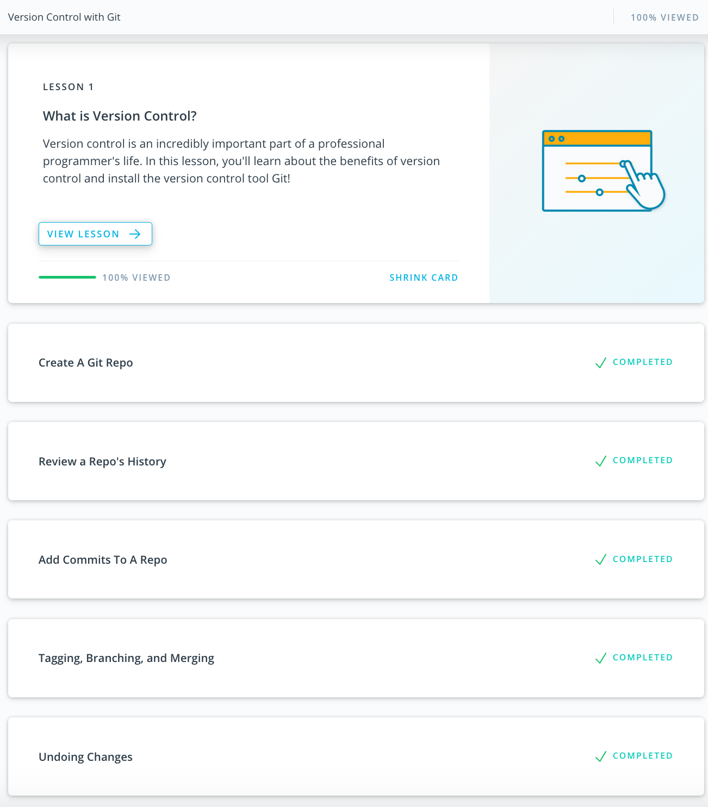
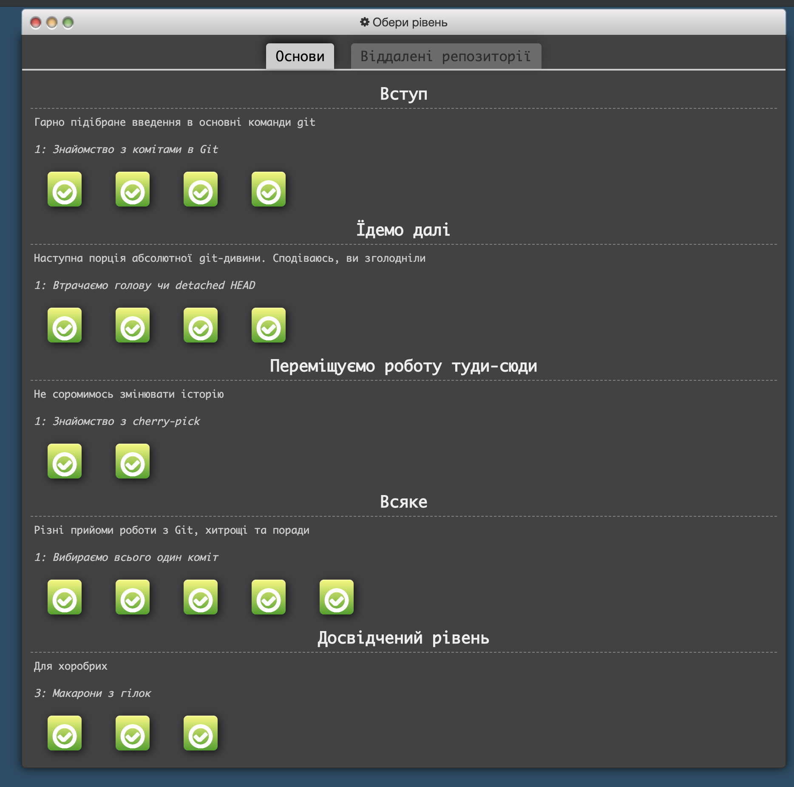
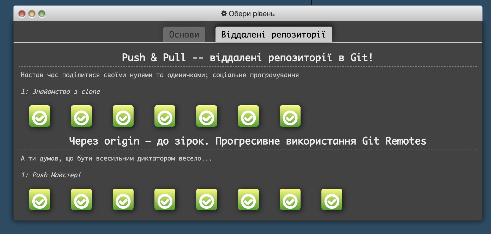
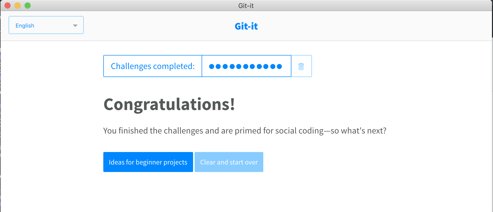
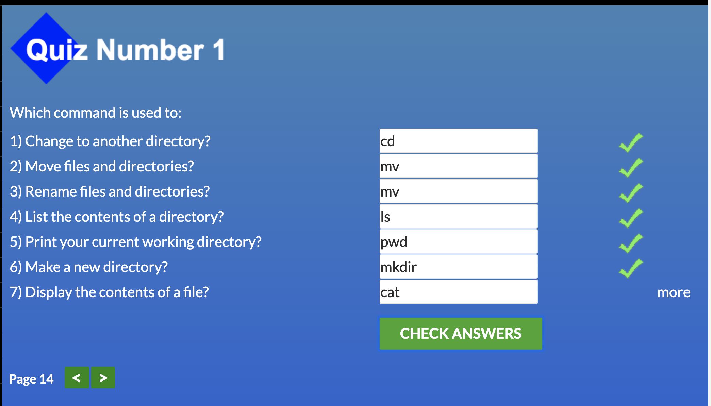
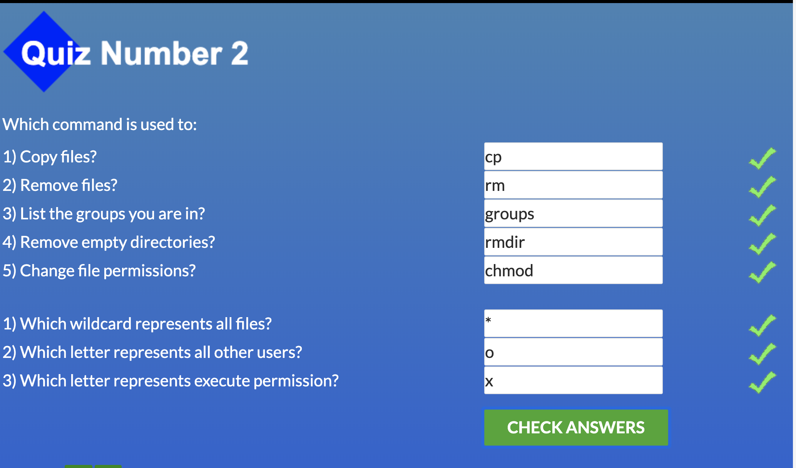
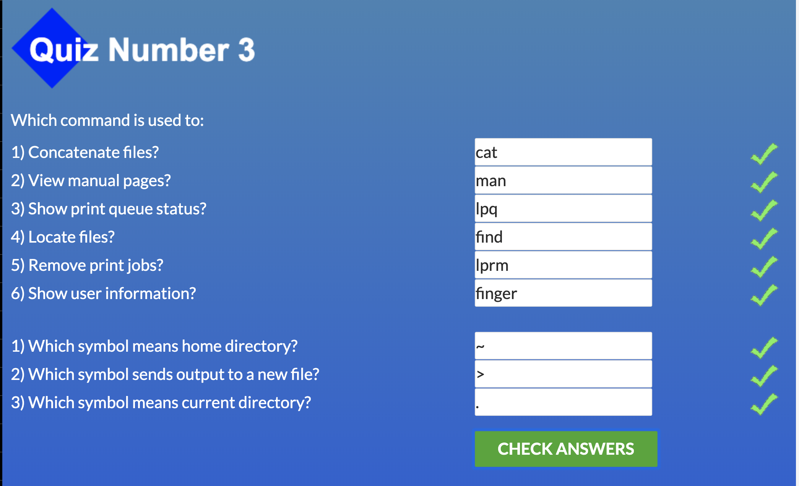
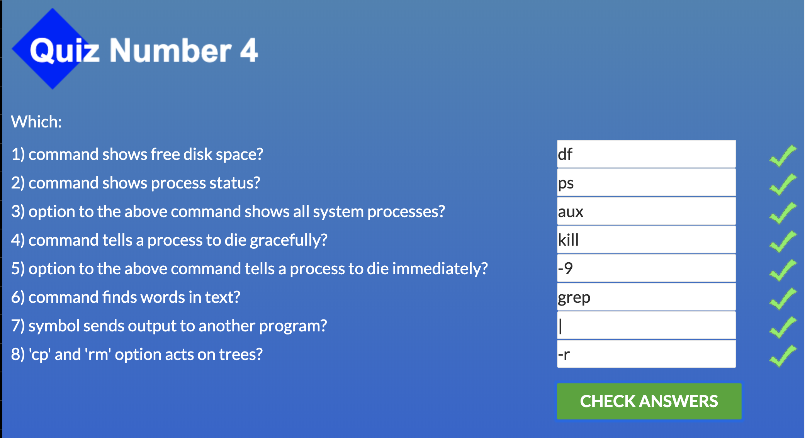

# Kottans Backend Course Progress

## Git and GitHub
 
 1. Udacity course gave a great overview about what is git and its main features.
 
 
 2. try.github.io tasks provided more complex and challenging git tasks.
 
 
 
 
## Unix Shell
 
 1. Linux Survival
 
    Basically all summary for this lesson can be viewed on the screenshots
    
    
    
    
    
 2. Learning the Shell section on linuxcommand.org
 
    New things and things to remember:
    
    - for chmod (`chmod 600 some_file`):
        
        rwx = 111 in binary = 7  
        rw- = 110 in binary = 6  
        r-x = 101 in binary = 5  
        r-- = 100 in binary = 4  
    - `kill -l` gives a list of the signals kill supports
    - jobs - an alternate way of listing your own processes
    - bg - put a process in the background
    - fg - put a process in the forground
    
