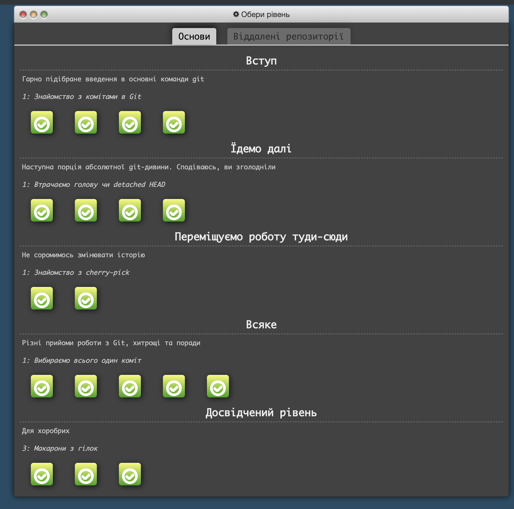

#Kottans Backend Course Progress

##Git and GitHub
 
 Udacity course gave a great overview about what is git and its main features.
 
 
 try.github.io tasks provided more complex and challenging git tasks.
 
 
 
